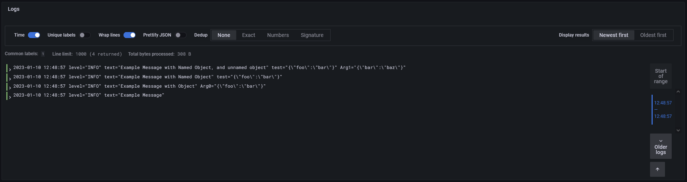

# Deno-Loki-Handler

A simple to use [Loki](https://grafana.com/oss/loki/) handler for deno std log

Please feel free to use the code in this project for your own projects this is
more a example than anything useful

```ts
import * as log from "https://deno.land/std@0.163.0/log/mod.ts";
import { LokiHandler } from "./mod.ts";

log.setup({
  handlers: {
    localLokiHandler: new LokiHandler("DEBUG", {
      url: "http://localhost:3100",
      enableArgNaming: true,
    }),
  },
  loggers: {
    main: {
      handlers: ["localLokiHandler"],
      level: "DEBUG",
    },
  },
});

const logger = log.getLogger("main");

logger.info("Example Message");
logger.info("Example Message with Object", { foo: "bar" });
logger.info("Example Message with Named Object", ["ARGNAMES", "test"], {
  foo: "bar",
});
logger.info(
  "Example Message with Named Object, and unnamed object",
  ["ARGNAMES", "test"],
  {
    foo: "bar",
  },
  { bar: "baz" }
);
```

## Arg Naming

If passing multiple argmuments into a log request, and argNaming is enabled on
the logger, an Array starting with "ARGNAMES" can be passed into the first arg
on the log function call, which will define the names used for the rest of the
arguments on the log line on prometheus

(see example)


